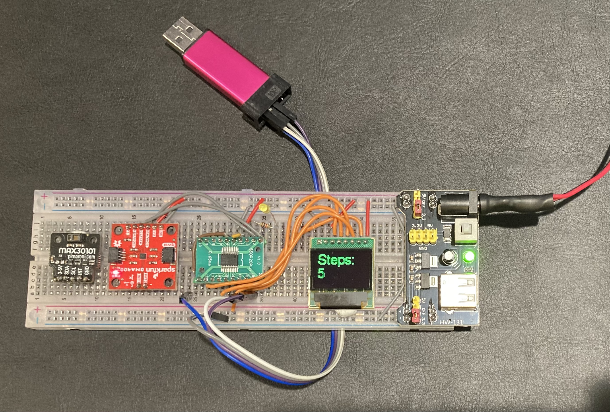

# Demo Project: Fitness Tracker

This is a project to demonstrate certain items of developing a hardware/software product.

The **FitT** fitness tracker is a fictional product.

## Purpose

The FitT fitness tracker will help you stay in shape. It is a light weight wearable design which monitors your movement and heart rate.

Demonstrate git repo usage in class.

## Repo Layout

- `hardware` KiCad project with schematic, pcb layout, plots, drawings
- `software` STM32 firmware and MX setup
- `documentation` Technical documentation and user manual

## Usage

See the [user documentation](documentation/UserDocumentation.md).

## Design

See the [design documentation](documentation/README.md).

## Credit

This project was made possible by borrowing from work available in the public domain, including:

- [BSTRobin's forum post](https://community.bosch-sensortec.com/mems-sensors-forum-jrmujtaw/post/bma400-library-for-stm32-8Wp5OBEzLzPqqNP) on the BMA400.

## Author

Written by Christian H, info@eeproto.com, 2025

## License

This work is available under the [Creative Commons Attribution-ShareAlike License 4.0](https://en.wikipedia.org/wiki/Wikipedia:Text_of_the_Creative_Commons_Attribution-ShareAlike_4.0_International_License). A local copy is available at [LICENSE.md](LICENSE.md).
