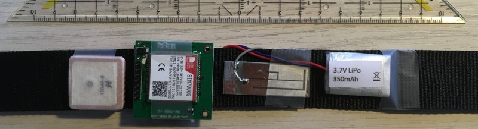

# FitT Design Decisions

## Microcontroller

Will use a member of the STM32 family because of familiarity, experience, availability, and lots of choices within the same framework.

Want:

- STM32 series
- low power consumption
- no major computational or peripheral requirements
- GPIO count less than 16
- minimum 32kB flash
- package that can be soldered by hand
- more than 1000 in stock at major distributors
- minimum 5y future availability

Best suited would be L0 series, low power, don't expect heavy computation. Or a C0 with slightly higher power consumption but lower prices.

## Step counting sensor

Will use a 3-axis MEMS accelerometer.

Have used ST LIS3DH before, availability good, library available, BOB too.

Or Bosch BMA400, very low power, specially designed for this kind of wearable applications.

## Display

LCD with backlight can have good contrast but is monochrome, looks kinda old fashioned.

TFTs are color and cheap, but not great outdoors and in the sunlight.

Will test an OLED as a high contrast option.

Display will need to be fitted with enclosure an need a gasket to seal against rainwater.

## Battery

Standard LiPo cell, as big as we can fit for maximum runtime.

Monitoring with a fuel gauge chip.

Charging with a standard 1S LiPo charger chip.

USB-C power-only fixed max 500mA interface.

Charge status indication: LEDs next to charger port? Or use display? But then that must be on while charging.

USB-C plug will have to be sealed or have a rubber cap to keep rain water out.

## Power Conservation

Turn display off when not in use.

Controller too?

Use motion sensor to wake up.

## User Interface Buttons

Momentary push buttons can be mounted behind push-through rubber caps for sealing.

## Design Study with GPS and Cell Modem

As a visualization to see what can be fitted to the wrist.
